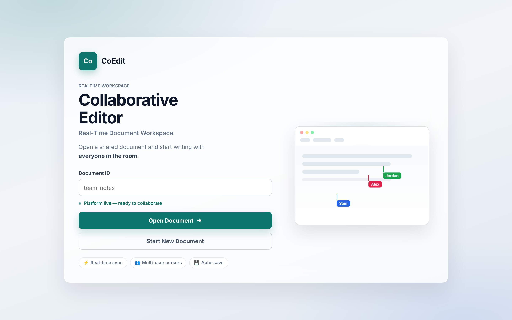
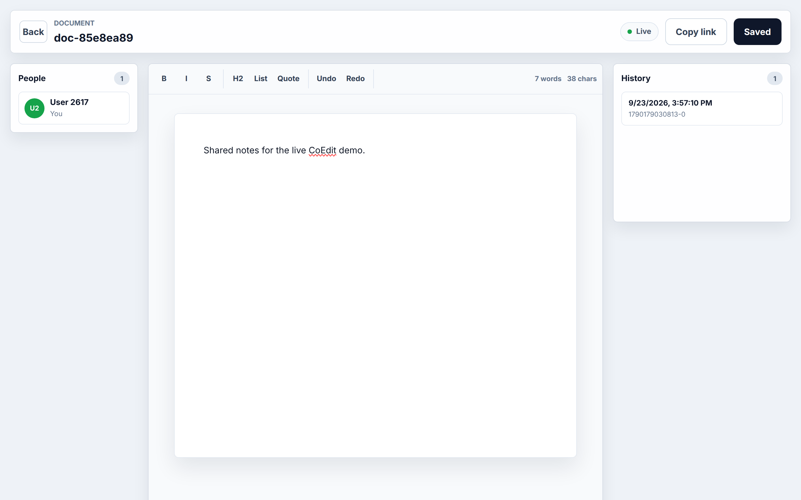
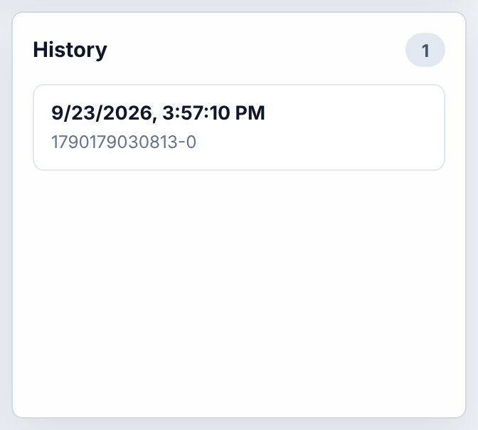

# Collaborative Real-Time Document Editor

A Google Docs–style editor for a junior software-engineer portfolio: several people open the same document and edit it together in real time. In the app the product name is CoEdit.

## Status

Checked 23 September 2026.

| Surface | State |
| --- | --- |
| Backend API | Up. [`GET /api/health`](https://crde-backend.onrender.com/api/health) returns `{"ok":true}`. Interactive docs: [https://crde-backend.onrender.com/docs](https://crde-backend.onrender.com/docs). The free Render instance can cold-start, so the first request after idle may take a while. |
| Public frontend | The URL previously listed here, `https://frontend-sable-kappa-64.vercel.app`, returns **404** (`DEPLOYMENT_NOT_FOUND`). It is offline. A different deployment, the CORS origin in `render.yaml`, is up: [https://collaborative-real-time-document-ed.vercel.app](https://collaborative-real-time-document-ed.vercel.app) (HTTP 200, this app, configured to call the Render API). |
| Demo to use | **Docker Compose on your machine.** That path does not depend on either host. |

## Features

- Start a new document or open one by ID. There are no accounts; the display name and color live in this browser.
- Edit the same document at the same time. Edits are Yjs updates sent over a WebSocket.
- See who is in the document and follow their cursors.
- Format with bold, italic, strikethrough, a level-2 heading, bullet lists, quotes, undo, and redo. The toolbar shows a word and character count.
- Persist each edit on a Redis stream. Save an explicit snapshot and preview it later. Snapshots are not restored into the live document.
- Reopen recent document IDs stored in this browser, and copy a link to the current document.
- Show connection state: live, connecting, reconnecting, or offline.

## Tech Stack

- **Frontend:** React, TypeScript, Vite, TipTap, Yjs, y-protocols awareness
- **Backend:** FastAPI, Python, WebSockets
- **Realtime state:** Yjs document updates and awareness presence
- **Storage and coordination:** Redis streams for updates and snapshots, Redis pub/sub across server instances

## Architecture

```txt
React + TipTap + Yjs
        |
        | WebSocket  /ws/docs/{doc_id}
        v
FastAPI realtime server
        |
        | Redis streams + pub/sub
        v
Redis
```

The editor binds TipTap to a Yjs document. Local updates and awareness go to `ws://<api>/ws/docs/{doc_id}`. FastAPI broadcasts them to clients on that process, appends document updates to a Redis stream, and publishes them so other instances can fan out the same event. Snapshot history is a second Redis stream, read back through REST:

- `GET /api/health`
- `GET /api/docs/{doc_id}/history`
- `GET /api/docs/{doc_id}/snapshot/{snapshot_id}`

## Demo

### Docker Compose (primary)

Requires Docker with Compose.

```bash
docker compose up --build
```

| Service | URL |
| --- | --- |
| Frontend | http://localhost:5173 |
| Backend | http://localhost:8000 |
| API docs | http://localhost:8000/docs |
| Redis | localhost:6379 |

Open two browser windows on `http://localhost:5173`, start a document in one, and open the same ID in the other.

Stop the stack:

```bash
docker compose down
```

The Compose frontend container runs Vite’s dev server (`npm run dev`) on port **5173**. The backend container listens on **8000**. Those ports match `docker-compose.yml` and the Dockerfiles. `frontend/vite.config.ts` does not override the port, so `npm run dev` outside Docker is also **5173**.

### Local, without Docker

Prerequisites:

- Node.js 22, or 20.19+ (the frontend image uses Node 22; Vite 7 needs one of those)
- Python 3.12 (matches `backend/Dockerfile` and `render.yaml`)
- Redis 7 listening on `localhost:6379`

Redis is not bundled. On macOS or Linux, install Redis and run `redis-server`. On Windows, run Redis in WSL, or use another local Redis build, and point `REDIS_URL` at it.

Backend (bash):

```bash
cd backend
python -m venv .venv
source .venv/bin/activate
pip install -r requirements.txt
uvicorn app.main:app --reload --host 0.0.0.0 --port 8000
```

Backend (Windows PowerShell):

```powershell
cd backend
python -m venv .venv
.\.venv\Scripts\Activate.ps1
pip install -r requirements.txt
uvicorn app.main:app --reload --host 0.0.0.0 --port 8000
```

Frontend (bash or PowerShell):

```bash
cd frontend
npm install
npm run dev
```

Open http://localhost:5173. The frontend defaults to `http://localhost:8000` and `ws://localhost:8000` when those env vars are unset.

## Environment variables

| Variable | Process | Default | Role |
| --- | --- | --- | --- |
| `VITE_API_BASE_URL` | frontend | `http://localhost:8000` | REST base for health and history |
| `VITE_WS_BASE_URL` | frontend | API base with `http` replaced by `ws` | WebSocket base. Production must use `wss://` |
| `REDIS_URL` | backend | `redis://localhost:6379/0` | Redis connection. Compose sets `redis://redis:6379/0` |
| `CORS_ORIGINS` | backend | `http://localhost:5173,http://127.0.0.1:5173` | Comma-separated browser origins |
| `UPDATES_MAXLEN` | backend | `20000` | Cap on the per-document update stream |
| `SNAPSHOTS_MAXLEN` | backend | `200` | Cap on the per-document snapshot stream |

`VITE_*` values are read when Vite starts. Changing them means restarting the dev server or rebuilding the static bundle.

## Deployment

### Render (backend and Redis)

`render.yaml` is the blueprint:

- **crde-redis** — Key Value, free plan
- **crde-backend** — Python web service, `rootDir: backend`, free plan, health check `GET /api/health`, start command `uvicorn app.main:app --host 0.0.0.0 --port $PORT`

The blueprint sets `PYTHON_VERSION=3.12.0`, wires `REDIS_URL` from the Key Value instance, and sets `CORS_ORIGINS` to the Vercel origin above plus local Vite origins. Render deploys from the connected branch. A manual deploy recorded for this service:

```bash
render deploys create srv-d92c43po3t8c73bb1c9g --confirm
```

Live API (verified 23 September 2026):

- https://crde-backend.onrender.com/api/health
- https://crde-backend.onrender.com/docs

### Vercel (frontend, optional redeploy)

There is no live frontend at `https://frontend-sable-kappa-64.vercel.app`. Do not send anyone there.

The deployment that is up today is [https://collaborative-real-time-document-ed.vercel.app](https://collaborative-real-time-document-ed.vercel.app). To publish a new build from this repo, deploy the `frontend/` directory (see `frontend/vercel.json` for the SPA rewrite) and set:

```txt
VITE_API_BASE_URL=https://crde-backend.onrender.com
VITE_WS_BASE_URL=wss://crde-backend.onrender.com
```

Add the resulting origin to `CORS_ORIGINS` on the Render service before relying on it. `npx vercel deploy --prod` from `frontend/` is enough once the project is linked.

## Screenshots

Still frames from the live frontend on 23 September 2026: [https://collaborative-real-time-document-ed.vercel.app](https://collaborative-real-time-document-ed.vercel.app). The document views are [`/docs/doc-85e8ea89`](https://collaborative-real-time-document-ed.vercel.app/docs/doc-85e8ea89). That document had no body text and no snapshots, so this capture typed one sentence in the editor and saved one snapshot. Docker Compose remains the demo path that does not depend on these hosts.

### Home



### Document editor



### History panel



## License

[MIT](LICENSE)
